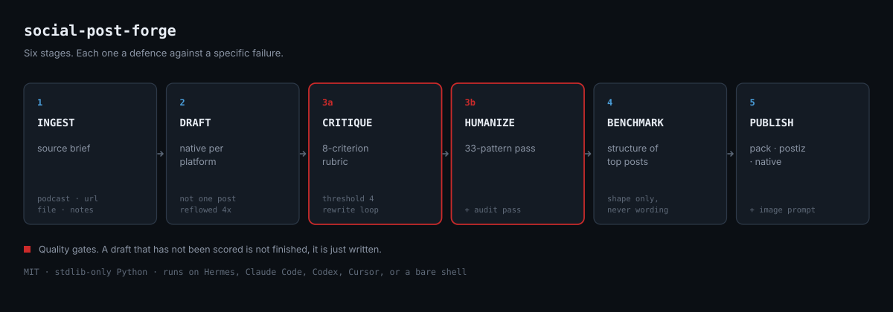
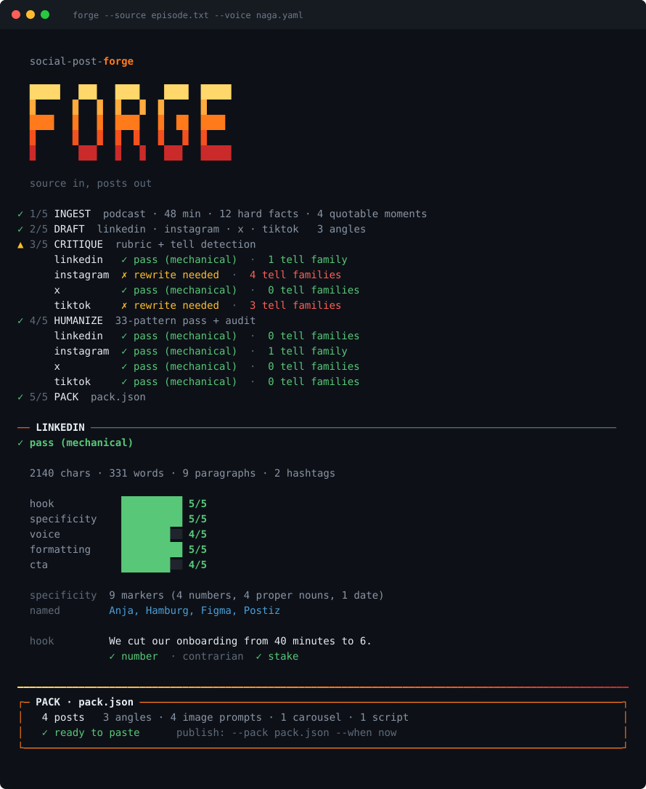

# social-post-forge

An agent skill that turns any source — a podcast episode, a business description, an article, a pile of notes — into platform-native social posts for LinkedIn, Instagram, X/Threads and TikTok. Every draft gets scored against a rubric, stripped of AI writing tells, rewritten against what is currently working in the niche, paired with an image prompt, and then either handed over as a copy-paste pack or published automatically.

Plain Markdown plus Python. No workflow builder, no monthly SaaS, no webhook plumbing.

Built by **Maurice Holda** at **[Naga Codex](https://nagacodex.cloud)**.



```
1. INGEST      source material  →  source brief + voice profile
2. DRAFT       source brief     →  native draft per platform
3a. CRITIQUE   draft            →  rubric score → rewrite until it passes
3b. HUMANIZE   passing draft    →  33-pattern pass → rewrite → audit pass
4. BENCHMARK   humanized draft  →  structural patterns from top posts → rewrite
5. VISUAL      final copy       →  image prompt (+ optional generated image)
6. PUBLISH     final pack       →  copy-paste / Postiz / native API
```

## Why the extra stages

The usual failure is not that models cannot write. It is that one generic post gets reflowed four ways, nobody checks it, and it reads like every other AI post in the feed. Each stage is a defence against a specific failure:

- **Native drafting** — a LinkedIn structure inside an Instagram caption reads wrong to anyone who uses both.
- **Rubric scoring** — a draft that has not been scored is not finished, it is just written. Eight criteria, threshold of 4, anti-fabrication must be 5.
- **The humanize pass** — a post can score well on every rubric criterion and still be unmistakably synthetic. Different failure, different fix.
- **Structure-only trend benchmarking** — trending posts never enter the drafting context. Only a pattern report crosses that boundary, which is the difference between informed by what works and a worse version of someone else's post.

## Install

### As an agent skill

The runtime artifact is `SKILL.md` with agentskills.io-compatible YAML frontmatter, so any harness that supports skill-style instructions can discover and load it — Hermes Agent, Claude Code, Codex, Cursor, OpenClaw.

**Hermes Agent** (Nous Research):

```bash
hermes skills install https://raw.githubusercontent.com/Nagacash/social-post-forge/main/SKILL.md
```

Use the installer rather than copying by hand — **the skills directory differs between Hermes deployments** (`~/.hermes/skills/` on some local installs, `/opt/data/skills/` on server and container builds), and dropping the folder in the wrong one leaves it invisible to `skills_list` with no error. If you do want the full repo rather than just `SKILL.md`, confirm the live path first:

```bash
hermes skills list          # shows where skills are being read from
git clone https://github.com/Nagacash/social-post-forge <that-path>/social-post-forge
```

**Claude Code / Cursor / any skills directory:**

```bash
git clone https://github.com/Nagacash/social-post-forge ~/.claude/skills/social-post-forge
```

**Cross-agent skills CLI:**

```bash
npx skills add Nagacash/social-post-forge
```

Clone the whole repo rather than just `SKILL.md` where you can. `SKILL.md` alone carries the full pipeline, but the references hold the 33-pattern catalogue and the rubric, and the scripts do the mechanical checking.

The skill names Hyperagent tools (`TranscribeAudio`, `ExaSearch`, `GenerateImage`) because that is where it was built. `SKILL.md` includes a capability-mapping table so an agent on another harness substitutes its own equivalents, and states what to skip — loudly — when a capability is missing. The scripts need no host tools at all.

### As a CLI

```bash
git clone https://github.com/Nagacash/social-post-forge
cd social-post-forge
cp .env.example .env
python3 scripts/forge.py --source episode.txt --voice voice-profiles/mine.yaml
```

No dependencies beyond the Python 3.8+ standard library.

**Any provider works.** Anthropic is the default, but set `FORGE_BASE_URL` and the CLI switches to the OpenAI-compatible `/chat/completions` shape:

```bash
FORGE_BASE_URL=https://openrouter.ai/api/v1 \
FORGE_API_KEY=sk-or-... \
FORGE_MODEL=meta-llama/llama-3.3-70b-instruct \
python3 scripts/forge.py --source episode.txt

# fully local, no key that matters
FORGE_BASE_URL=http://localhost:11434/v1 FORGE_API_KEY=x \
FORGE_MODEL=llama3.1 python3 scripts/forge.py --source episode.txt
```

**Running against a local model.** The pipeline makes five to seven sequential generations, each streaming thousands of tokens. On a hosted model that is under a minute; on a quantized model running on CPU it is minutes per call, and a *cold* model adds the disk load on top — which looks like a hang rather than slowness. Warm it and keep it resident:

```bash
ollama run gemma3:4b "hi"            # pay the load cost once
export OLLAMA_KEEP_ALIVE=30m         # stop eviction between calls
export FORGE_TIMEOUT=3600            # default is already 900s for local
```

`FORGE_TIMEOUT` defaults to 180s for hosted providers and **900s when `FORGE_BASE_URL` is set**, because a local run that was always going to take ten minutes should not be killed at three. Timeouts exit with the warm-up instructions rather than a stack trace. `FORGE_KEEP_ALIVE` passes Ollama's `keep_alive` through on every call if you would rather not set the env var.

Expect roughly 10 minutes end to end for four platforms on a warm 4B model on CPU, and considerably worse cold. That is decode speed, which no amount of prompt trimming fixes.

**Prompt size is handled at the source.** The rewrite stage used to carry all 33 catalogue patterns and the full rubric on every call — 53% of the largest prompt was two static files. It now carries only the patterns the detector actually fired plus the judgement guards, and a slimmed checker report. Measured on a real single-dash survivor: **25,576 → 9,776 characters, a 62% cut, about 3,950 input tokens saved per rewrite.** Selective rather than compressed, because a banned-word list is exactly the kind of text you must not lossily compress.

The CLI is deliberately the thinner experience: mechanical critique only, and no trend benchmarking, because that stage needs a browsing agent. **If you already run Hermes, Claude Code or Codex, use the skill instead** — the agent drives the stages with real reasoning, needs no key at all, and gets you the critique and benchmark stages the CLI cannot do.

## Usage

```bash
# Full pipeline, all four platforms
python3 scripts/forge.py --source episode.txt --voice voice-profiles/mine.yaml

# Two platforms, save the pack
python3 scripts/forge.py --source notes.md --platforms linkedin,x --out pack.json

# Check an existing draft without generating anything
python3 scripts/critique.py --file draft.txt --platform linkedin
python3 scripts/humanize_check.py --file draft.txt

# Publish
python3 scripts/publish_postiz.py --pack pack.json --when now
python3 scripts/publish_native.py --platform linkedin --pack pack.json
```

## The humanize pass

`references/humanizer.md` carries the full 33-pattern catalogue, ported from [blader/humanizer](https://github.com/blader/humanizer) (MIT) and Wikipedia's [Signs of AI writing](https://en.wikipedia.org/wiki/Wikipedia:Signs_of_AI_writing) guide, maintained by WikiProject AI Cleanup. It is embedded here rather than referenced as an external dependency, so the skill is self-contained.

The insight underneath all 33 patterns, in Wikipedia's words:

> LLMs use statistical algorithms to guess what should come next. The result tends toward the most statistically likely result that applies to the widest variety of cases.

`scripts/humanize_check.py` detects the mechanically findable subset — dashes, invisible unicode, the AI vocabulary cluster, negative parallelism, rule-of-three runs, filler, signposting, aphorism formulas, inline-header lists, hedge stacks, staccato runs and sentence-length uniformity. It scores by **pattern families hit**, not raw count, because most tells only convict in combination.


**Hard rules vs judgement calls.** Most patterns only convict in combination, so the detector scores by pattern family. But dashes and invisible unicode fail at *any* count — they are not judgement calls, and the rubric fails the post on formatting regardless. Those produce a `hard_fail` verdict and a non-zero exit, and `forge.py` runs a targeted repair pass rather than shipping them with a soft verdict.

**Machine-fixable versus writer-fixable.** Invisible unicode and the ellipsis have exact replacements, so `--fix-safe` handles them deterministically and `forge.py` applies it after every generation. Dashes never get auto-fixed: swapping `—` for `-` keeps the construction that gave it away. Splitting these means the repair loop only ever asks a model for the thing that genuinely needs writing, which matters most on a slow local model.

Three rules keep the pass honest:

1. **Never invent facts.** Specificity has to come from the source or the author, never from the rewrite. A rewrite that adds a plausible statistic to sound concrete has made the post worse.
2. **A writing sample outranks every style rule**, including the em dash ban. If the author uses them, keep them at their frequency. Sounding like the author beats scrubbing the tell.
3. **Do not sand the post into blandness.** Removing every flagged pattern *and* every opinion, aside and specific leaves competent nothing. That is a failed pass, not a strict one.

## The CLI

`forge.py` runs the whole pipeline outside an agent harness. Colour is truecolor where the terminal supports it, degrades through 256 and 16 colour, and strips to plain ASCII when piped or when `NO_COLOR` is set — so output stays greppable and safe to redirect into a log.



Progress goes to stderr and the pack goes to stdout, so `forge.py --source x.txt --json > pack.json` works without the banner landing in your JSON.

## Publishing

| Mode | Setup | Cost | Use when |
|---|---|---|---|
| Copy-paste pack | none | free | Default. Posting a few times a week. |
| [Postiz](https://github.com/gitroomhq/postiz-app) self-hosted | Docker stack | free | Posting daily across several platforms. |
| Native APIs | one OAuth app per platform | mostly free | You only care about one platform. |

Two things worth knowing before you invest an afternoon, both verified August 2026:

- **X is pay-per-use** since February 2026. Roughly $0.01 per post, about **$0.20 if the post contains a URL**. No free tier for new developers.
- **TikTok requires an audit.** Unaudited apps can only post privately (`SELF_ONLY`), and TikTok's content-sharing guidelines explicitly name "a utility tool to help upload contents to the account(s) you or your team manages" as not acceptable.

For those two, the copy-paste pack is usually the honest answer. Full setup instructions, endpoints, scopes, token lifetimes and gotchas are in `references/publishing-setup.md`.

Postiz is the recommended bridge because its self-hosted build has no feature gating and covers all four platforms. Mixpost Lite is free but only covers X, Facebook Pages and Mastodon; LinkedIn, Instagram, TikTok and Threads sit behind its paid tier.

## Layout

```
SKILL.md                              the pipeline — the runtime artifact
references/
  humanizer.md                        33-pattern catalogue + rewrite rules
  ai-tells.md                         condensed three-layer quick card
  rubric.md                           8 scoring criteria, 1-5 each
  platform-conventions.md             per-platform rules, evidenced vs practice
  publishing-setup.md                 Postiz + native API setup
scripts/
  forge.py                            CLI: full pipeline
  ui.py                               terminal styling, stdlib only
  critique.py                         mechanical rubric checks
  humanize_check.py                   AI-tell detector
  publish_postiz.py                   self-hosted Postiz publishing
  publish_native.py                   direct platform APIs
examples/
  voice-profile.example.yaml          the schema, filled in
assets/                               README imagery
```

## The voice profile

Captured once per business, reused every run. The field that matters is `reference_posts` — three real posts that performed well, pasted verbatim including the things that look like mistakes. Those are the voice. Adjectives like "professional but warm" teach a model nothing.

See `examples/voice-profile.example.yaml`.

## Credits

- [blader/humanizer](https://github.com/blader/humanizer) (MIT) — the 33-pattern catalogue
- [Wikipedia: Signs of AI writing](https://en.wikipedia.org/wiki/Wikipedia:Signs_of_AI_writing) — WikiProject AI Cleanup, the source underneath it
- [starside-io/ghostwriter](https://github.com/starside-io/ghostwriter) (MIT) — the three-layer tell framework
- [kvsdileep/linkedin-writer](https://github.com/kvsdileep/linkedin-writer) (MIT) — the three-step hook formula
- [Postiz](https://github.com/gitroomhq/postiz-app) (AGPL-3.0) — the self-hosted publishing bridge
- Pipeline ideas from `alankritxghosh/william.ai`, `pauxiel/linkedin-ghost-writer`, `rayane-rhsn/autopost-ai` and Akamai's multi-agent social transform example

## Built by

**[Naga Codex](https://nagacodex.cloud)** — Maurice Holda. We build AI systems for people who need them to work in production, not in a demo.

If you use this and it helps, or it breaks, open an issue. Both are useful.

## License

MIT. See [LICENSE](LICENSE). Use it commercially, fork it, strip the branding — that is the point of the licence.
